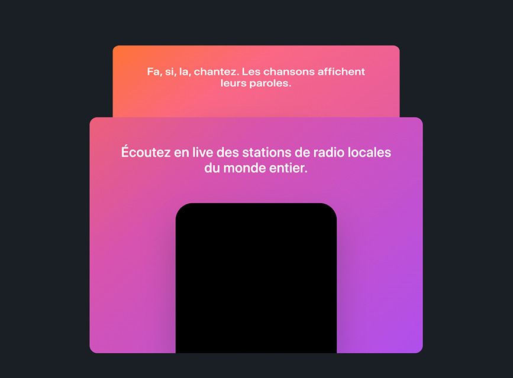

# Stacked cards

Stacked cards animation inspired by Apple Music website, I used Gsap 3 and ScrollScene which is an extra layer on top of ScrollMagic



## Building and running on localhost

First install dependencies:

```sh
npm install
```

Start dev

```sh
npm start
```

Build

```sh
npm run build
```

# Ussage
```sh
new StackedCards({ options })
```
## Options

| Option        | Description                              |
| ------------- |----------------------------------------  |
| element       | card class name eg: .card                |
| indicators    | show or hide ScrollMagic indicators      |
| offset        | space between each card                  |
| pin           | card pin top offset                      |


## Credits

[createapp.dev](https://createapp.dev/) \
[GSAP 3](https://github.com/greensock/GSAP) \
[ScrollScene](https://github.com/jonkwheeler/ScrollScene)

